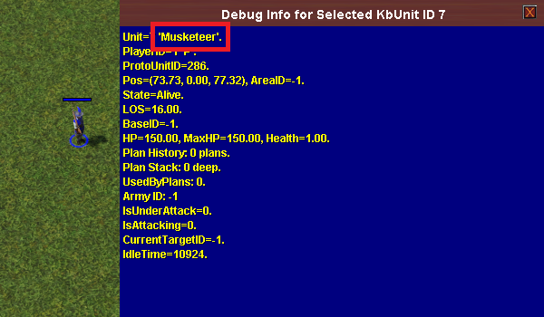

# Proto Units

!!! warning "This page is a work in progress"

    TODO:

    - Split the functions in [Proto Unit Properties](#2-proto-unit-properties)
      into their own subsections.
    - Add an example for each function.
    - Add more details if relevant (e.g. constants for movement types).

Proto units are the "items" that can be seen in the command panel or the
scenario editor's object catalog.

??? example "Proto units (command panel)"

    ")

??? example "Proto units (scenario editor)"

    ")

## 1. Proto Unit ID

The proto unit ID is required in order to obtain any information about a
proto unit. It's an integer number that is stored in a constant prefixed with
`cUnitType` (e.g. `cUnitTypeMusketeer`).

To find the proto unit ID of a proto unit, proceed as follows:

- place the unit in the scenario editor.
- select the unit.
- press ++alt+q++ to open the debugger.
- at the top right, click on **Misc**.
- click on **Display Selected KBUnit (Dynamic)**.
- a small blue window will appear with the proto unit name. Prefix this name
  with `cUnitType` to get the proto unit ID.

??? example "Proto unit name"

    In this example, the proto unit name is `Musketeer`, so the proto unit ID is
    `cUnitTypeMusketeer`.

    

## 2. Proto Unit Properties

```cpp
// Returns the build limit of the given proto unit
// for the given player. Returns -1 if there is no limit.
int kbGetBuildLimit(int playerID, int protoUnitID);
// Returns how much population space the given proto unit
// gives when it's on the map.
int kbGetPopCapAddition(int playerID, int protoUnitID);
// Returns how much population space the given proto unit
// takes when it's on the map.
int kbGetPopSlots(int playerID, int protoUnitID);
// Returns the number of pop slots currently occupied by this unit type.
int kbGetPopulationSlotsByUnitTypeID(int playerID, int unitTypeID);
// Returns true if the given proto unit can path from pointA to pointB.
// (Omit the last parameter).
bool kbCanPath2(vector pointA, vector pointB, long protoUnitID, float range);
// Returns true if the protoUnit is currently available.
bool kbProtoUnitAvailable(int protoUnitID);
// Returns the proto unit ID of the given proto unit name.
int kbGetProtoUnitID(string protoUnitName);
// Returns the cost of the protounit for the given resource type.
float kbUnitCostPerResource(int protoUnitID, int resourceTypeID);
// Returns the amount of time it takes to train the proto unit.
float kbUnitGetTrainPoints(int protoUnitID);
// Returns true if the proto unit belongs to the given type.
bool kbProtoUnitIsType(int playerID, int protoUnitID, int unitTypeID);
// Returns the associated tech of this proto unit.
int kbProtoUnitGetAssociatedTech(int protoUnitID);
// Returns the AI cost for the given proto unit.
float kbGetProtoUnitAICost(int protoUnitID);
// Returns the rate at which the given gatherer
// gathers the given resource from the given resource unit.
float kbProtoUnitGetGatherRate(int gathererProtoUnitID,
                               int resourceProtoUnitID,
                               int resourceTypeID);
// Returns the pop count of the proto unit.
int kbGetProtoUnitPopCount(int protoUnitID);
// Checks whether the proto unit can train the specified unit.
bool kbProtoUnitCanTrain(int sourceProtoUnitID, int trainProtoUnitID);
// Returns pop cap of the proto unit.
int kbProtoUnitGetPopCap(int protoUnitID);
// Returns build points of the proto unit.
float kbProtoUnitGetBuildPoints(int protoUnitID);
// Returns LOS of the proto unit.
float kbProtoUnitGetLOS(int protoUnitID);
// Returns the amount of XP gained by
// building/training this proto unit.
float kbProtoUnitGetBuildBounty(int protoUnitID);
// Returns the amount of XP gained when killing this proto unit.
float kbProtoUnitGetBounty(int protoUnitID);
// Returns the name corresponding to the proto unit ID.
string kbGetProtoUnitName(int protoUnitID);
// Returns the name corresponding to the unit type ID.
string kbGetUnitTypeName(int unitTypeID);
```
