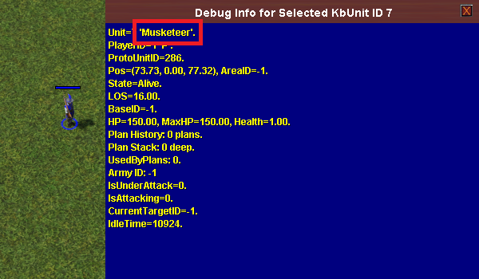

# Proto Units

!!! warning "This section is a work in progress"

    TODO:

    - Add an example for each function.
    - Add more details if relevant (e.g. constants for movement types).

Proto units are the "items" that can be seen in the command panel or the
scenario editor's object catalog.

??? example "Proto units (command panel)"

    ")

??? example "Proto units (scenario editor)"

    ")

## Getting the Proto Unit ID

The proto unit ID is required in order to obtain any information about a
proto unit. It's an integer number that is stored in a constant prefixed with
`cUnitType` (e.g. `cUnitTypeMusketeer`).

To find the proto unit ID of a proto unit, proceed as follows:

- place the unit in the scenario editor.
- select the unit.
- press ++alt+q++ to open the debugger.
- at the top right, click on **Misc**.
- click on **Display Selected KBUnit (Dynamic)**.
- a small blue window will appear with the proto unit name. Prefix this name
  with `cUnitType` to get the proto unit ID.

??? example "Proto unit name"

    In this example, the proto unit name is `Musketeer`, so the proto unit ID is
    `cUnitTypeMusketeer`.

    
